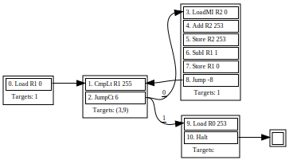

Verification framework for spacecraft control programs targeting the Redfin instruction-set architecture for space satellites subsystems.

The framework is implemented in the [Haskell](https://www.haskell.org/) functional programming language and employs a number of [GHC](https://www.haskell.org/ghc/) language extensions to employ the type system for specification of instruction semantics.

## Redfin instruction-set architecture

Redfin is a minimalist [RISC](https://en.wikipedia.org/wiki/Reduced_instruction_set_computer) instruction-set architecture (ISA) and processing core created by [RUAG Space Austria](https://www.ruag.com/en/products-services/space) to control space satellite subsystems.

## Polymorphic semantics of Redfin instruction-set architecture

This project implements a simulation, testing and verification framework for Redfin by modelling the semantics of Redfin's instructions in terms of a polymorphic fine-grained state interface, describing how and which parts of the ISA state are read and written. The fine-grained state interface can then be implemented in terms of a concrete state datatype with its associated `read` and `write` functions.

The fine-grained state interface is a rank-2 polymorphic function which abstracts over the following components:
* The `key` type variable represents the considered parts of the ISA state: registers, flags, memory, etc. It usually will be instantiated with a sum type.
* The `control` constraint can be instantiated with a type class constraint such as `Functor`, `Applicative`, `Selective` or `Monad`, and represents what kind of control flow the instruction uses, thus enabling light-weight static analysis of non-monadic instructions. This idea is inspired by [Build Systems à la Carte](https://github.com/snowleopard/build).
* The `value` is a list of type class constraints which describe which operations on values the semantics perform. These can include something like `Num` for arithmetic instructions of `Ord` for instructions that compare values.

```haskell
type FS (key :: *)
        (control :: (* -> *) -> Constraint)
        (value :: [* -> Constraint])
        (a :: *) =
  forall f . (control f, CS value a)
          => (key -> f a)        -- read
          -> (key -> f a -> f a) -- write
          -> f a
```

The whole semantics is quantified over the `f` type constructor that will be instantiated with something like `State s` for a simple simulator, or a more complex type constructor. The `read` and `write` callbacks receive a `key` and describe the effects they perform in terms of `f`. Note that the second argument of `write` is wrapped into `f`, thus representing not the value to be written, but a *computation* that delivers the value. This little detail is crucial for the framework: as we will show later, at allows in many cases to avoid the monadic control-flow and thus keep the ability of static analysis.

### Example instruction semantics

For the examples we instantiate the `key` type variable with the following algebraic data type:
```haskell
-- | Abstraction over possible locations in the ISA
data Key where
  Reg :: Register -> Key
  -- ^ data register
  Addr :: Address -> Key
  -- ^ memory cell
  F :: Flag -> Key
  -- ^ flag, a special boolean register
  IC :: Key
  -- ^ instruction counter
  IR :: Key
  -- ^ instruction register
  Prog :: Address -> Key
  -- ^ program address
```

Consider a simplified semantics of the instruction that loads a value from a memory cell to a register:

```haskell
-- | Load a value from a memory cell to a register
load :: Register -> Address -> FS Key Unconstrained '[] a
load reg addr read write = write (Reg reg) (read (Addr addr))
```

As the signature suggests, loading a value is very permissive: we do not need to know anything about neither the value nor we need any control flow operators.

A marginally more complex semantics can be given to setting a register with an literal immediate argument:

```haskell
-- | Write an immediate argument to a register
set :: Register -> Imm a -> FS Key Applicative '[] a
set reg (Imm imm) _ write =
  write (Reg reg) (pure imm)
```

As we see, to be able to embed a pure value of the immediate argument we need `Applicative` control-flow. 

However, our approach really starts to bring benefits when we transfer to instructions that alter the ISA state conditionally. For example, `jumpCt` updates the instruction counter only if the `Condition` flag is set:

```haskell
-- | Perform jump if flag @Condition@ is set
jumpCt :: Imm a -> FS Key Selective '[Boolean, Num] a
jumpCt (Imm offset) read write =
  ifS (toBool <$> read (F Condition))
      (write IC ((+) <$> pure offset <*> read IC))
      (pure 0)
```

If it was not for [Selective applicative functors](https://hackage.haskell.org/package/selective), this semantics would need to be monadic: it analyses the effectful boolean `f Bool` and decides whether to perform the jump of not. Here, we also need to restrict the values to be boolean and numeric. Note that in the interface implementation the type `a` which is here constrained with `Boolean` and `Num` constraints can actually be instantiated with symbolic expressions containing variables, or concrete words for efficient simulation, or values from an abstract domain for performing classic full-blown analysis.

Pointers, are a feature that often makes formal verification, especially with symbolic execution, notoriously difficult. Redfin supports pointers by means of a memory-indirect load instruction, the semantics for which needs careful consideration. In general, the `Selective` control-flow provides us with an ability to [branch on a value of a bounded enumerable type](https://hackage.haskell.org/package/selective-0.4.2/docs/Control-Selective.html#v:bindS). Since Redfin, like any actual computing core, operates with finite memory, we can potentially consider a selective semantics for memory-indirect load. However, we choose to make it monadic, mostly for efficiency considerations:

```haskell
-- | Load a value referenced by another  value in a memory cell to a register
loadMI :: Register -> Address -> FS Key Monad '[Addressable] a
loadMI reg pointer read write =
  read (Addr pointer) >>= \x ->
    case toAddress x of
      Nothing   -> error $ "ISA.Semantics.loadMI: invalid address " <> show x
      Just addr -> write (Reg reg) (read (Addr addr))
```

This simplified semantics converts the value read from a memory cell to an address and reads the memory cell addressed by it. The semantics can be refined to rise a processor exception in case of an invalid address.

## Static analysis via `Selective`

The semantics of most instructions (leaving out `loadMI`) has `Selective` control-flow, which allows us to implement the following function to find out which keys are affected by the semantics *without* running the semantics:

```haskell
dependencies :: FS key Selective '[Any] a -> (Reads [key], Writes [key])
```

The `dependencies` function produces an over-approximation of the keys read and written, and is employed by the control-flow graph backend to of the framework. For example, here is a control-flow graph of a program that sums up an  array of numbers:



Note that the control-flow graph backend only analyses the dependencies of instructions that affect the instruction counter, thus the presence of memory-indirect load on line 3 does not cause any issues.

See [`ISA.Backend.Graph`](https://github.com/geo2a/redfin-lib/blob/master/src/ISA/Backend/Graph.hs) and [`ISA.Backend.Graph.BasicBlock`](https://github.com/geo2a/redfin-lib/blob/master/src/ISA/Backend/Graph/BasicBlock.hs)for implementation.

## Symbolic execution

The framework supports symbolic execution of Redfin programs by instantiating the semantics with symbolic state which maintains a symbolic execution tree of the program and employs an SMT-solver to check reachability of states. See the module [`ISA.Backend.Symbolic.Zipper.Run`](https://github.com/geo2a/redfin-lib/blob/master/src/ISA/Backend/Symbolic/Zipper/Run.hs) for an entry point to the backend's implementation.

